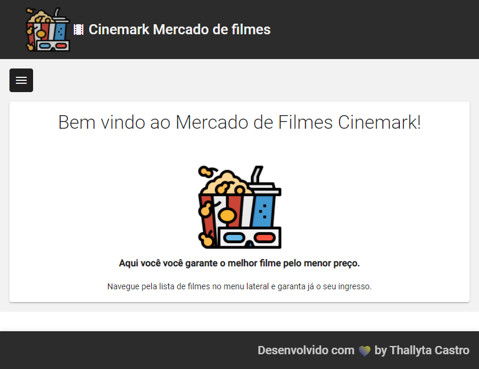
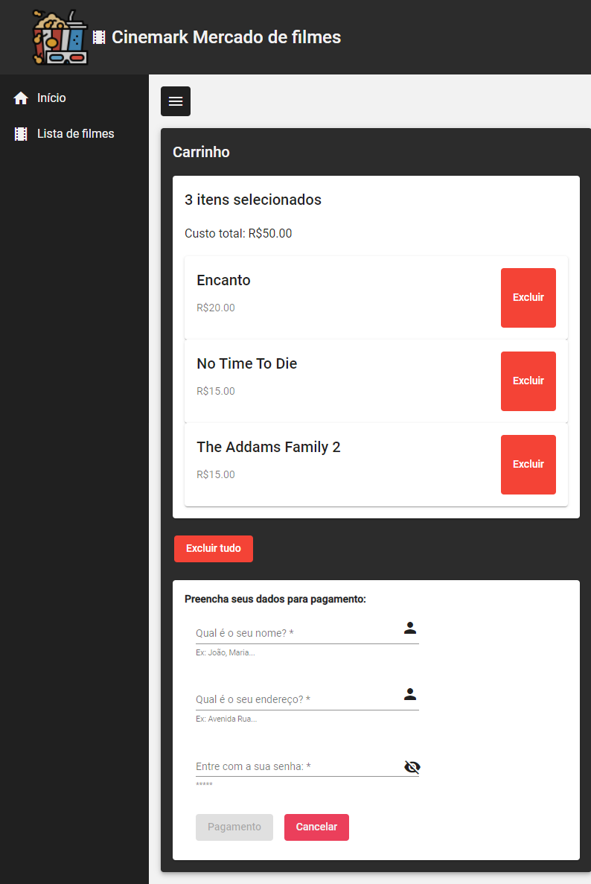

# Marketplace Cinemark Angular

Este projeto foi criado na lab do Digital Innovation One.

# Sobre o projeto
Este projeto consiste em uma aplicação simples em Angular de um marketplace de filmes que consome uma base de dados do arquivo db.json para carregar uma lista de filmes para compra.
O filme ou uma lista de filmes é adicionado ao carrinho onde é calculado o valor total e os filmes selecionados. É possível também remover um item da lista do carrinho, ou remover tudo. 
No final é pedido os dados do usuário para finalizar o pagamento e concluidos os mesmo, tem um botão que envia o pagamento e retorna uma mensagem para o usuário da confirmação da compra.

# Layout do projeto

!Lista de Filmes](2.png)

# Tecnologias utilizadas
## Frontend

* HTML
* CSS 
* Javascript
* Typescript 4.5.2
* Angular CLI 13.2.3
* Angular Material 13.2.2
* Node
* NPM

## Backend

* json-server

# Autor
<b>Thallyta Macedo Carvalho de Castro</b>

Linkedin: https://www.linkedin.com/in/thallyta-castro/

Medium: https://medium.com/@thallyta-castro-cv

email: contato@thallytacastro.com.br
